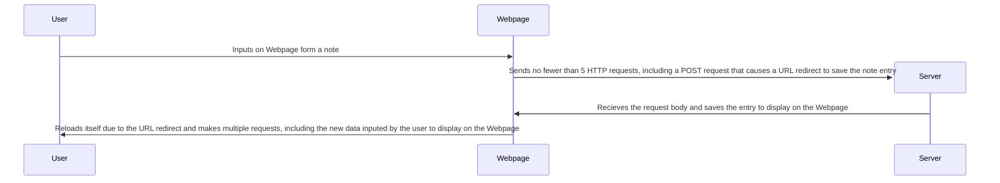

```mermaid
sequenceDiagram
participant User
participant Webpage

User->>Webpage: Inputs on Webpage form a note
create participant Server
Webpage->>Server: Sends no fewer than 5 HTTP requests, including a POST request that causes a URL redirect to save the note entry
Server->>Webpage: Recieves the request body and saves the entry to display on the Webpage
Webpage->>User: Reloads itself due to the URL redirect and makes multiple requests, including the new data inputed by the user to display on the Webpage

```
