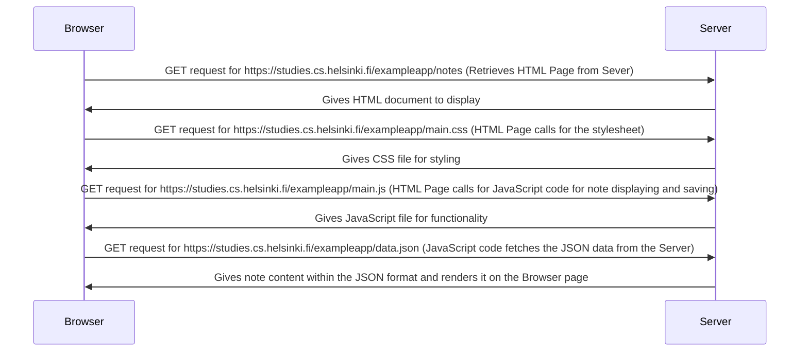

```mermaid
sequenceDiagram
participant Browser
participant Server

Browser->>Server: GET request for https://studies.cs.helsinki.fi/exampleapp/notes (Retrieves HTML Page from Sever)
Server->>Browser: Gives HTML document to display
Browser->>Server: GET request for https://studies.cs.helsinki.fi/exampleapp/main.css (HTML Page calls for the stylesheet)
Server->>Browser: Gives CSS file for styling
Browser->>Server: GET request for https://studies.cs.helsinki.fi/exampleapp/main.js (HTML Page calls for JavaScript code for note displaying and saving)
Server->>Browser: Gives JavaScript file for functionality
Browser->>Server: GET request for https://studies.cs.helsinki.fi/exampleapp/data.json (JavaScript code fetches the JSON data from the Server)
Server->>Browser: Gives note content within the JSON format and renders it on the Browser page

```
