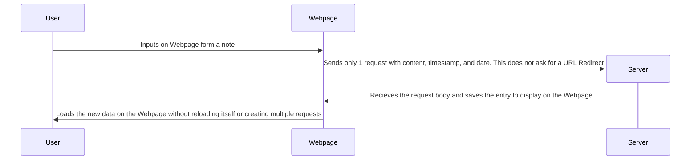

```mermaid
sequenceDiagram
participant User
participant Webpage

User->>Webpage: Inputs on Webpage form a note
create participant Server
Webpage->>Server: Sends only 1 request with content, timestamp, and date. This does not ask for a URL Redirect
Server->>Webpage: Recieves the request body and saves the entry to display on the Webpage
Webpage->>User: Loads the new data on the Webpage without reloading itself or creating multiple requests

```
